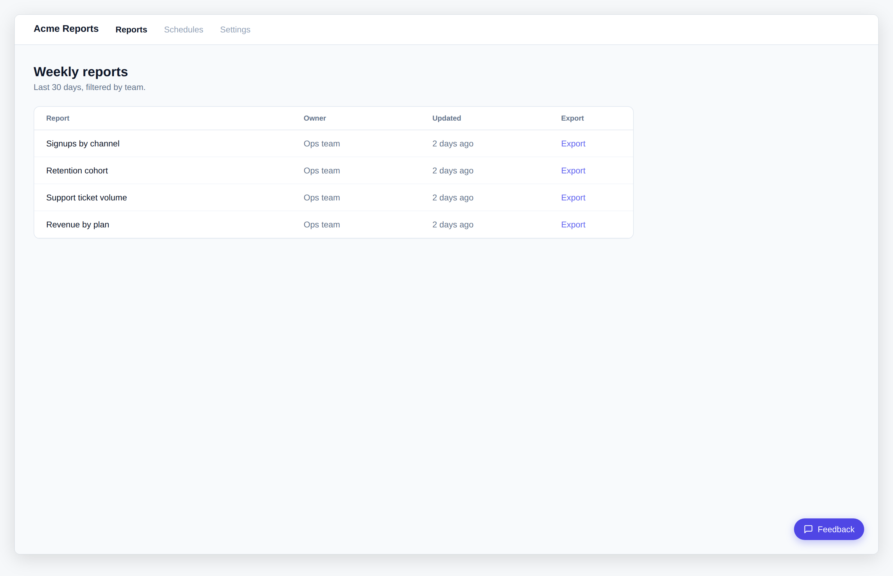
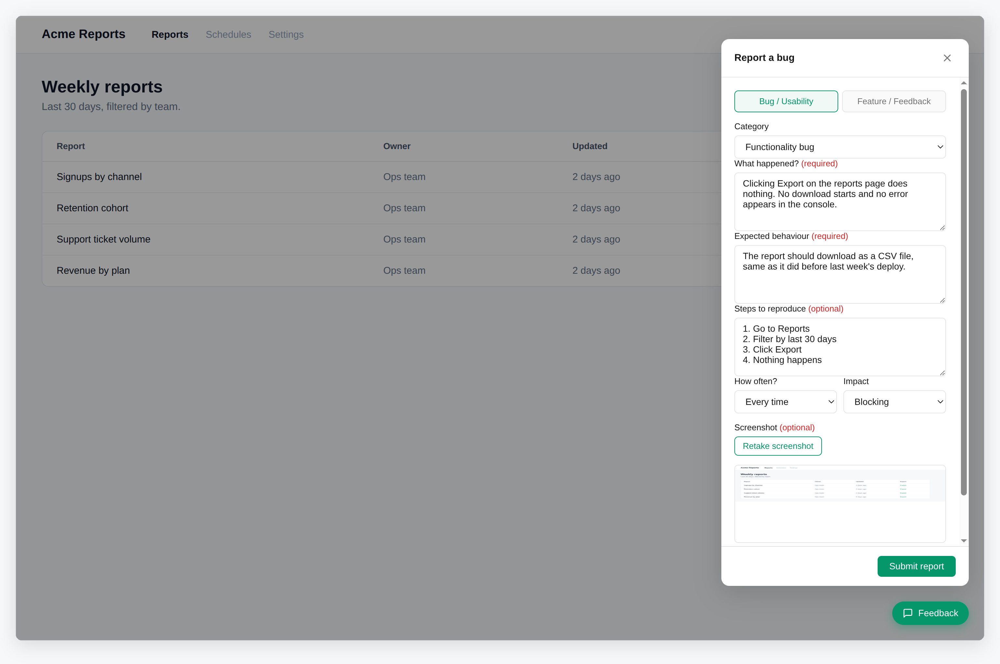
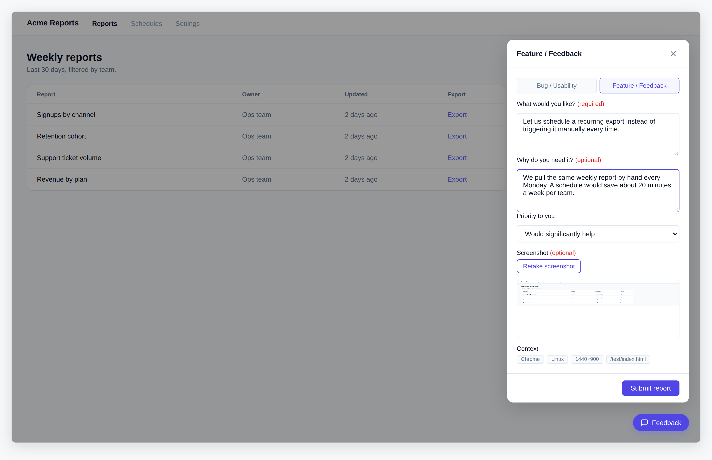
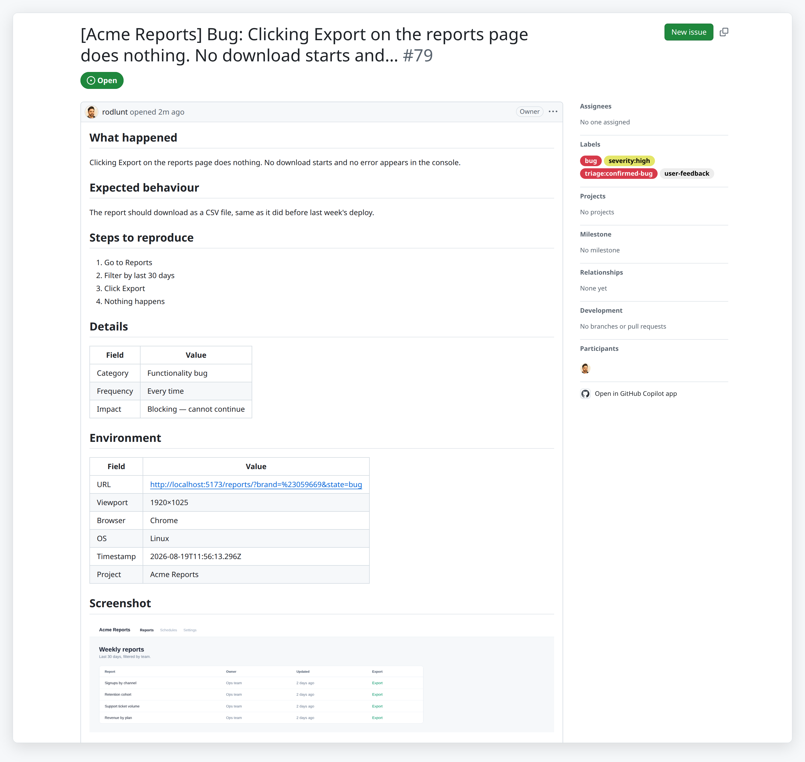
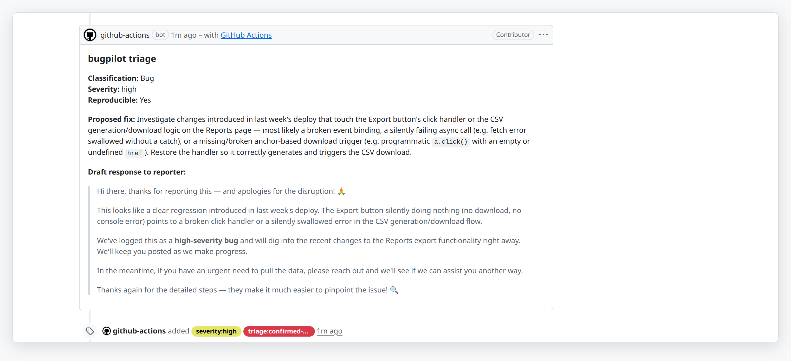

# bugpilot

Drop-in feedback and bug-capture widget with structured issue creation, AI triage via Claude, and NTFY action notifications.

<p align="center">
  <a href="https://raw.githubusercontent.com/rodlunt/bugpilot/main/docs/images/screenshot-hero-light.png"><picture>
    <source media="(prefers-color-scheme: dark)" srcset="docs/images/screenshot-hero-dark.png">
    
  </picture></a>
</p>

<p align="center">
  <a href="https://raw.githubusercontent.com/rodlunt/bugpilot/main/docs/images/screenshot-bug-report-light.png"><picture>
    <source media="(prefers-color-scheme: dark)" srcset="docs/images/screenshot-bug-report-dark.png">
    
  </picture></a>
  <a href="https://raw.githubusercontent.com/rodlunt/bugpilot/main/docs/images/screenshot-feature-request-light.png"><picture>
    <source media="(prefers-color-scheme: dark)" srcset="docs/images/screenshot-feature-request-dark.png">
    
  </picture></a>
</p>

<p align="center"><sub>One widget, three host themes: the accent colour in each shot comes from the host app (<code>BugPilot.init({ color })</code> or <code>--bp-*</code> overrides). Out of the box the widget is grayscale until your app supplies a colour.</sub></p>

## What lands in GitHub

Every submission becomes a structured issue: the report fields, an environment table (with a "Reporter" row when the host passes `user`), a machine-readable context block, and the captured screenshot, committed to a `bug-report-screenshots` branch in your repo and embedded in the body. Labels are applied on creation.

<p align="center">
  <a href="https://raw.githubusercontent.com/rodlunt/bugpilot/main/docs/images/screenshot-github-issue-light.png"><picture>
    <source media="(prefers-color-scheme: dark)" srcset="docs/images/screenshot-github-issue-dark.png">
    
  </picture></a>
</p>

Moments later the triage action has classified it, assessed severity, applied labels, and drafted a reply for the reporter:

<p align="center">
  <a href="https://raw.githubusercontent.com/rodlunt/bugpilot/main/docs/images/screenshot-github-triage-light.png"><picture>
    <source media="(prefers-color-scheme: dark)" srcset="docs/images/screenshot-github-triage-dark.png">
    
  </picture></a>
</p>

<p align="center"><sub>A real report, submitted through the widget and triaged end to end: <a href="https://github.com/rodlunt/bugpilot/issues/79">see the live issue</a>.</sub></p>

## What it does

1. **Capture** — a lightweight widget embeds in any web app. Users submit a bug report or feature request; the widget auto-collects viewport, browser, OS, and URL context plus an optional screenshot.
2. **Create** — a structured GitHub issue is created with all captured data in a consistent machine-readable format. Screenshots are committed to a `bug-report-screenshots` branch and embedded as images.
3. **Triage** — a Claude GitHub Action fires on every widget-submitted issue. Bugs are classified, severity assessed, and a proposed fix drafted. Feature requests receive a simple acknowledgement. A comment is posted and triage labels are applied automatically.
4. **Notify** — an NTFY push notification is sent with the proposed fix summary and two action buttons: 🟢 Approve (triggers the apply-fix workflow) and 🔴 Manual review (opens the issue).
5. **Fix** — the apply-fix workflow runs a Claude agentic loop that reads the repo, implements the fix, and opens a PR. A follow-up NTFY is sent when the PR is ready.

## Widget: two report paths

**Bug / Usability:** what happened, expected behaviour, steps to reproduce (optional), frequency, impact.

**Feature / Feedback:** what would you like, why do you need it (optional), priority.

## Widget options

```js
BugPilot.init({
  endpoint: 'https://your-worker.workers.dev/feedback', // required
  projectName: 'My Site',        // issue title prefix; defaults to document.title
  color: '#1c1b1a',              // optional accent; sets --bp-primary and derived tokens
  variant: 'pill',               // 'pill' (default) or 'tab'
  position: 'bottom-right',      // pill only: bottom-right | bottom-left | top-right | top-left
  side: 'right',                 // tab only: 'right' (default) or 'left'
  triggerLabel: 'Feedback',      // pill only: text beside the icon
  icon: '<svg ...>...</svg>',    // optional inline SVG replacing the trigger glyph (both variants)
  user: { name: 'Ada Lovelace', login: 'ada' }, // optional reporter identity, see below
})
```

| Option | Default | Notes |
|---|---|---|
| `endpoint` | required | Worker URL the widget POSTs to. |
| `projectName` | `document.title` | Prefixes the issue title. |
| `color` | none | Six-digit hex. Sets `--bp-primary`, `--bp-primary-hover`, `--bp-primary-shadow` and `--bp-primary-soft` on the widget elements. |
| `variant` | `'pill'` | `'pill'` is the labelled corner button. `'tab'` is an icon-only 36px square (44px hit area) docked flush against a viewport edge with a small peek so it reads as a handle. |
| `position` | `'bottom-right'` | Pill only. Ignored by the tab. |
| `side` | `'right'` | Tab only. Which edge the tab docks to on first visit. |
| `triggerLabel` | `'Feedback'` | Pill only. |
| `icon` | built-in glyph | Inline `<svg>` markup. Draw with `currentColor` so the host accent applies. Rejected (with a console warning and fallback to the default) unless it starts with `<svg` and contains no `<script`, `on*=` attributes, `javascript:` URLs, `<foreignObject>` or remote `<use>`. |
| `user` | none | `{ name, login }`, both optional strings. Trimmed, angle brackets stripped, capped at 120 characters each. Sent with the report and rendered as a "Reporter" row in the issue plus a `reporter` key in the structured block. Leave it out and reports stay anonymous. |

**Tab behaviour.** The tab slides vertically along its edge by pointer drag (mouse and touch share
one Pointer Events path). Dragging it horizontally past the viewport midline and releasing swaps
it to the other edge. A tap (under 6px of movement) opens the dialog as normal. The resulting
`{ side, y }` is saved in `localStorage` under a per-origin key so it comes back where the user
left it; a missing, blocked or corrupt value falls back to `side` and a vertically centred tab.
Snap animations are disabled under `prefers-reduced-motion`.

## Theming

The widget injects one stylesheet and reads every colour, radius, border, shadow and font from a
`--bp-*` custom property. Override them on `body` (or any ancestor with higher specificity than
`:root`, since the widget's own defaults live on `:root` and are injected after your stylesheet).

| Token | Default | Used for |
|---|---|---|
| `--bp-primary` | `#262626` | Trigger and submit background, focused input border, ghost button text |
| `--bp-primary-hover` | `#404040` | Hover state of the above |
| `--bp-primary-soft` | `rgba(0, 0, 0, 0.05)` | Ghost button hover, active type-picker button |
| `--bp-primary-shadow` | unset | Colour used inside the default `--bp-trigger-shadow`; set by `color` |
| `--bp-on-primary` | `#ffffff` | Text and icon colour on `--bp-primary` |
| `--bp-surface` | `#ffffff` | Dialog and input background |
| `--bp-surface-raised` | `#fafafa` | Chips, inactive type-picker buttons, close button hover |
| `--bp-border` | `#e5e5e5` | Dialog border, header and footer rules, inputs, chips |
| `--bp-border-width` | `1px` | Width of the dialog and trigger borders |
| `--bp-text` | `#171717` | Body text and labels |
| `--bp-text-muted` | `#737373` | Chips, inactive buttons, close icon |
| `--bp-required` | `#dc2626` | "(required)" and "(optional)" label suffixes |
| `--bp-error` | `#ef4444` | Error status text |
| `--bp-error-soft` | `rgba(239, 68, 68, 0.08)` | Error status background |
| `--bp-success` | `#22c55e` | Success status text |
| `--bp-success-soft` | `rgba(34, 197, 94, 0.08)` | Success status background |
| `--bp-backdrop` | `rgba(0, 0, 0, 0.4)` | Page overlay while the dialog is open |
| `--bp-radius` | `12px` | Dialog corners |
| `--bp-radius-sm` | `6px` | Inputs, buttons, status box, screenshot preview |
| `--bp-radius-xs` | `4px` | Context chips |
| `--bp-shadow` | `0 10px 40px rgba(0, 0, 0, 0.15)` | Dialog shadow |
| `--bp-trigger-radius` | `999px` | Pill trigger corners |
| `--bp-trigger-border-color` | `transparent` | Trigger border colour (pill and tab face); set to `var(--bp-border)` for an ink outline |
| `--bp-trigger-shadow` | `0 4px 14px var(--bp-primary-shadow, rgba(0, 0, 0, 0.25))` | Trigger shadow (pill and tab face) |
| `--bp-tab-size` | `36px` | Visible tab square |
| `--bp-tab-hit` | `44px` | Tab hit area (WCAG 2.5.8 minimum) |
| `--bp-tab-peek` | `4px` | How far the tab face tucks under the viewport edge at rest |
| `--bp-tab-radius` | `0` | Outer corners of the tab face |
| `--bp-z-index` | `2147483647` | Stacking of trigger, backdrop and dialog |
| `--bp-font` | system stack | Font family for all widget text |

### Example: editorial theme

A paper-and-ink look: graphite text, redline accent for required fields and errors, square
corners, a 1px ink border in place of shadows, and an edge-docked tab trigger.

```css
body {
  --bp-primary: #1c1b1a;
  --bp-primary-hover: #3a3835;
  --bp-primary-soft: rgba(28, 27, 26, 0.06);
  --bp-on-primary: #ffffff;
  --bp-required: #b3401d;
  --bp-error: #b3401d;
  --bp-error-soft: rgba(179, 64, 29, 0.08);
  --bp-surface: #fff6e5;
  --bp-surface-raised: #ffffff;
  --bp-border: #1c1b1a;
  --bp-border-width: 1px;
  --bp-trigger-border-color: #1c1b1a;
  --bp-text: #1c1b1a;
  --bp-text-muted: #5e5a54;
  --bp-radius: 0;
  --bp-radius-sm: 0;
  --bp-radius-xs: 0;
  --bp-trigger-radius: 0;
  --bp-tab-radius: 0;
  --bp-shadow: none;
  --bp-trigger-shadow: none;
  --bp-font: "IBM Plex Sans", ui-sans-serif, system-ui, sans-serif;
}
```

```js
BugPilot.init({ endpoint, projectName: 'Groundwork', variant: 'tab', side: 'right' })
```

Contrast of every text/background pair in this theme (WCAG 2.x, AA needs 4.5:1 for body text):

| Pair | Ratio |
|---|---|
| `#1c1b1a` text on `#fff6e5` paper | 16.02:1 |
| `#5e5a54` muted on `#fff6e5` paper | 6.38:1 |
| `#5e5a54` muted on `#ffffff` raised | 6.85:1 |
| `#ffffff` on `#1c1b1a` primary (trigger, submit) | 17.20:1 |
| `#ffffff` on `#3a3835` hover | 11.69:1 |
| `#b3401d` redline on `#fff6e5` (required labels) | 5.33:1 |
| `#b3401d` error text on its soft tint over paper (`#f9e7d5`) | 4.75:1 |
| `#1c1b1a` on `#ffffff` | 17.20:1 |

## Design goals

- **Drop-in, minimal setup.** One script tag. One config object. Works.
- **Theme-agnostic.** CSS custom properties inherit from the host app; the widget looks native. The default palette is grayscale, so colour only appears when the host supplies it (`BugPilot.init({ color })` or `--bp-*` overrides).
- **BYO API key.** The Actions are reusable GitHub Actions — consumers supply their own `ANTHROPIC_API_KEY`.
- **No external CDN required.** Screenshots are stored in a branch of your own repo.
- **No laptop required.** The full pipeline from user report to merged fix can run without touching a laptop.

## Status

M1, M2, and M3 complete and working end-to-end.

## Getting started (development)

**Widget:**
```bash
cd widget && npm install
npm run dev        # opens test harness at localhost:5173
npm run build      # produces dist/bugpilot.es.js, .umd.js, .iife.js
```

`pnpm test` runs the widget unit suite (vitest + jsdom, `widget/test/*.test.js`): trigger
variants, tap-versus-drag, side swap, localStorage restore and the icon and user sanitisers.
Still exercise both report paths (bug and feature) in the harness `pnpm dev` opens before
shipping a UI change; jsdom does not lay out CSS. CI runs `pnpm test` and `pnpm build` on
every push and PR; see `.github/workflows/ci.yml`.

**Cloudflare Worker:**
```bash
cd backend && npm install
# Create backend/.dev.vars with:
#   GITHUB_TOKEN=<PAT — see secrets table below for required scopes>
#   GITHUB_REPO=owner/repo
#   ALLOWED_ORIGIN=http://localhost:5173
npx wrangler dev   # local dev on localhost:8787
npx wrangler deploy
npm run typecheck  # tsc --noEmit; CI runs this on every push and PR
```

**Triage Action (consumers):**

Add to your repo's workflow:
```yaml
- uses: rodlunt/bugpilot/actions/triage@v1
  with:
    anthropic-api-key: ${{ secrets.ANTHROPIC_API_KEY }}
    ntfy-topic: ${{ secrets.NTFY_TOPIC }}                    # optional
    webhook-secret: ${{ secrets.WEBHOOK_SECRET }}            # optional, for apply-fix
    bugpilot-worker-url: ${{ secrets.BUGPILOT_WORKER_URL }}  # optional, for apply-fix
```

**Apply-fix Action (consumers):**

Add to your repo's workflow — triggered by `workflow_dispatch` with an `issue_number` input, or automatically via the NTFY 🟢 Approve button once the Worker is deployed:
```yaml
- uses: rodlunt/bugpilot/actions/apply-fix@v1
  with:
    issue-number: ${{ github.event.inputs.issue_number }}
    anthropic-api-key: ${{ secrets.ANTHROPIC_API_KEY }}
    ntfy-topic: ${{ secrets.NTFY_TOPIC }}                    # optional
```

Also required: **Settings → Actions → General → tick "Allow GitHub Actions to create and approve pull requests".**

**GitHub Actions secrets (consumer repo):**

| Secret | Purpose |
|---|---|
| `ANTHROPIC_API_KEY` | Claude API key for triage and apply-fix |
| `NTFY_TOPIC` | NTFY topic — accepts a plain slug (`my-topic`), a host/path (`ntfy.example.com/my-topic`), or a full URL (`https://ntfy.sh/my-topic`) |
| `WEBHOOK_SECRET` | Shared secret for the Worker `/webhook/apply-fix` endpoint |
| `BUGPILOT_WORKER_URL` | Deployed Worker base URL — wires the 🟢 Approve NTFY button |

**Worker secrets (set via `wrangler secret put`):**

| Secret | Purpose | Required PAT scopes |
|---|---|---|
| `GITHUB_TOKEN` | Creates issues, commits screenshots, dispatches workflows | Classic PAT: `repo` + `workflow`. Fine-grained: Contents (R/W), Issues (R/W), Actions (R/W) |
| `GITHUB_REPO` | Target repo as `owner/repo` | — |
| `WEBHOOK_SECRET` | Same value as the Actions secret above | — |

**Worker env vars (set in `wrangler.toml` or via `wrangler secret put`):**

| Var | Default | Purpose |
|---|---|---|
| `ALLOWED_ORIGIN` | `*` | CORS allowed origin(s). Accepts a single origin or a comma-separated list (e.g. `https://www.example.com,https://app.example.com`). |
| `APPLY_FIX_WORKFLOW` | `apply-fix.yml` | Filename of the apply-fix workflow the Worker dispatches when 🟢 Approve is tapped. Change this if you name your workflow differently. |

## Licence

[MIT](./LICENSE)

---

<sub>Built by [Rodney Lunt](https://rod.lunt.au). If this saved you some time, you can [buy me a coffee](https://buymeacoffee.com/rodlunt).</sub>
